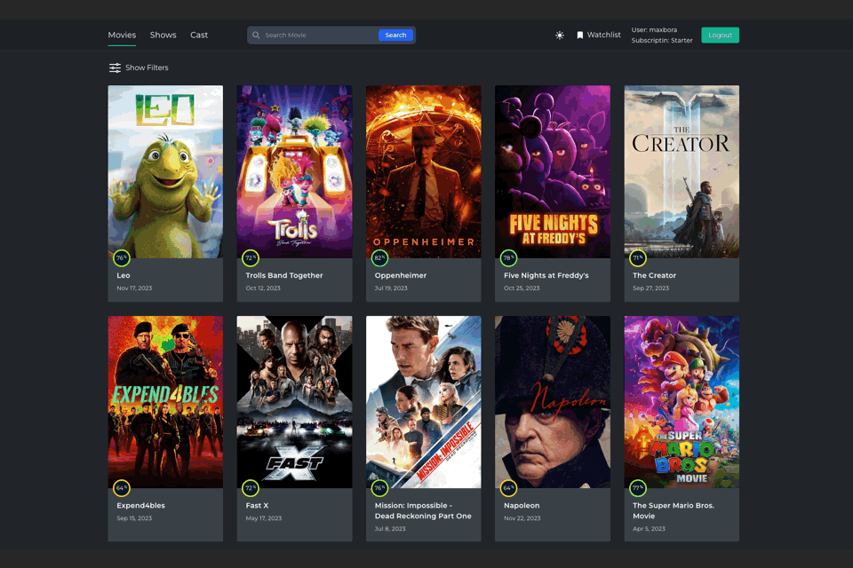

# Cinelounge

Cinelounge is a web application for finding movies to suit any taste and
preference.

## Technologies used:

 Vite template React +
TypeScript

| Frontend                   | Backend       |
| -------------------------- | ------------- |
| HTML/CSS                   | Node.Js (ES6) |
| JavaScript                 | Bcrypt        |
| React                      | Cors          |
| TypeScript                 | Dotenv        |
| Tailwind                   | Express       |
| Pagination                 | Gravatar      |
| Material UI                | Joi           |
| Axios                      | Jsonwebtoken  |
| Rc-Slider                  | Mongoose      |
| React Router Dom           | Morgan        |
| React Select               | Multer        |
| themoviedb.org (Data Base) | Mongo DB      |
