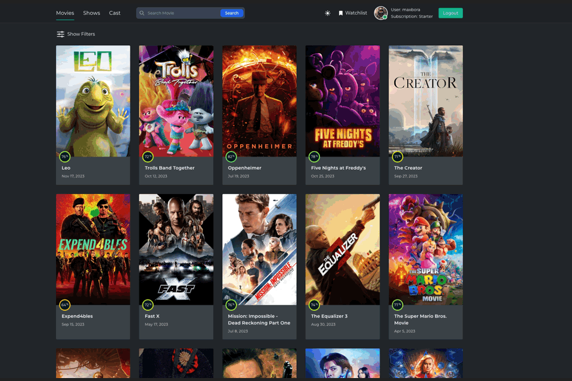

# Cinelounge

Cinelounge is a web application for finding movies to suit any taste and
preference.

## Technologies used:

 Vite template React +
TypeScript

| Frontend                   | Backend       |
| -------------------------- | ------------- |
| HTML/CSS                   | Node.Js (ES6) |
| JavaScript                 | Bcrypt        |
| React                      | Cors          |
| TypeScript                 | Dotenv        |
| Tailwind                   | Express       |
| Pagination                 | Gravatar      |
| Material UI                | Joi           |
| Axios                      | Jsonwebtoken  |
| Rc-Slider                  | Mongoose      |
| React Router Dom           | Morgan        |
| React Select               | Multer        |
| themoviedb.org (Data Base) | Mongo DB      |

## Description:

The user has the ability to register their account, verify their email, and
fully utilize the watchlist feature, where they can keep a list of all the
movies they want to watch. There's an option to change the avatar. Additionally,
a multifunctional filter for movies or series works excellently alongside
pagination. There's a keyword or title search function. Users can view trailers,
image galleries of movies, and a list of all actors and crew. There's also the
capability to view detailed information about a specific actor, navigate to
their social media page, or view a list of popular movies featuring that actor
and watch trailers for those movies.

## Project deployed on:

The frontend is deployed on Netlify server with a custom domain, and the backend
is deployed on Render server.
